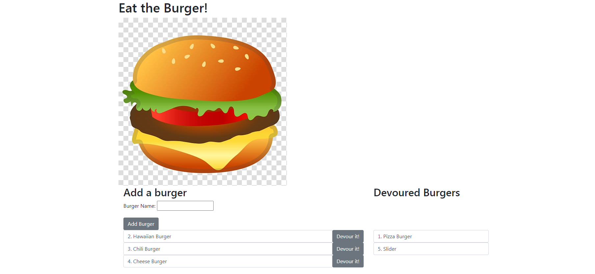

# Eat-Da-Burger

## Description

An application to demonstrate the use of a homebrew ORM.

When you open this application, you will be able to add new burgers and devour existing burgers. When a burger is added you will see it populate in the left side of the page, when a burger is devoured, you will see it populate on the right side of the page.

## Table of Contents

- [Installation](https://github.com/kas1330/Eat-Da-Burger#installation)

- [Usage](https://github.com/kas1330/Eat-Da-Burger#usage)

- [License](https://github.com/kas1330/Eat-Da-Burger#license)

- [Contributions](https://github.com/kas1330/Eat-Da-Burger#contributions)

- [Testing](https://github.com/kas1330/Eat-Da-Burger#testing)

- [Questions](https://github.com/kas1330/Eat-Da-Burger#questions)

- [Repo](https://github.com/kas1330/Eat-Da-Burger#repo)

- [Deployed](https://github.com/kas1330/Eat-Da-Burger#deployed)

## Installation

Use git clone to copy the repository to your computer. You should then be able to change the password in connection.js and launch the server. Then go to localhost:8080 in the browser, and the app should pop up.

## Usage

This purpose of this app is to demonstrate a homemade ORM.

## License

None

## Contributions

Submit a pull request.

## Testing

The easiest way to test the function of the application would be to click on the link to the deployed app on Heroku. You should be able to Add and devour burgers and see the page respond accordingly. The more difficult way to test would be to git clone the repository, add the schema and seeds files to your mysql workbench, and change the password in the connection.js file. Then go to the terminal and type in node server.js, you should see "APP listening on PORT: 8080". Go to your browser and type in "localhost:8080", this will launch the app, and you should be able to follow the same steps as the deployed version to test the app.

## Questions

https://github.com/kas1330

k.sexton804@gmail.com

## Repo

https://github.com/kas1330/Eat-Da-Burger

## Deployed

https://eat-the-burger-app123.herokuapp.com/
